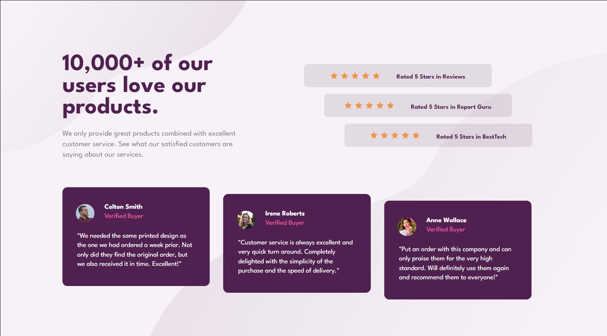
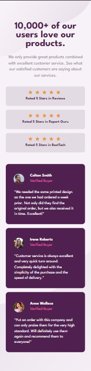

# Frontend Mentor - Social proof section solution

This is a solution to the [Social proof section challenge on Frontend Mentor](https://www.frontendmentor.io/challenges/social-proof-section-6e0qTv_bA). Frontend Mentor challenges help you improve your coding skills by building realistic projects.

## Table of contents

- [Overview](#overview)
  - [The challenge](#the-challenge)
  - [Screenshot](#screenshot)
  - [Links](#links)
- [My process](#my-process)
  - [Built with](#built-with)
  - [What I learned](#what-i-learned)
  - [Continued development](#continued-development)
  - [Useful resources](#useful-resources)
- [Author](#author)

## Overview

### The challenge

Users should be able to:

- View the optimal layout for the section depending on their device's screen size

### Screenshot

### Links

- Solution URL: [Add solution URL here](https://your-solution-url.com)
- Live Site URL: [Add live site URL here](https://your-live-site-url.com)

## My process

### Built with

- Semantic HTML5 markup
- CSS custom properties
- Flexbox

### What I learned

This project helped me solidify knowledge of flex and grid. I tried both when creating the desktop design, but ended up using flex.

### Continued development

I would like to focus on responsive design and the transition between the two. The current solution doesnt have the nices transition, so it something I will defenitely work on.

### Useful resources

- [Taking on a FrontEndMentor.io challenge!](https://www.youtube.com/watch?v=K27WULzr2P8&t=6581s) - This helped me with the background design. Obviously his approach is much more thorough, I tried to solve the challenge with just basic html & css, but it was still very usefull to watch how someone with more experince solved the challenge focusing on every detail.

## Author

- Frontend Mentor - [@zp021](https://www.frontendmentor.io/profile/zp021)
- GitHub - [@zp021](https://github.com/zp021)
